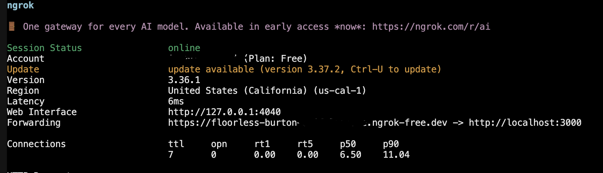
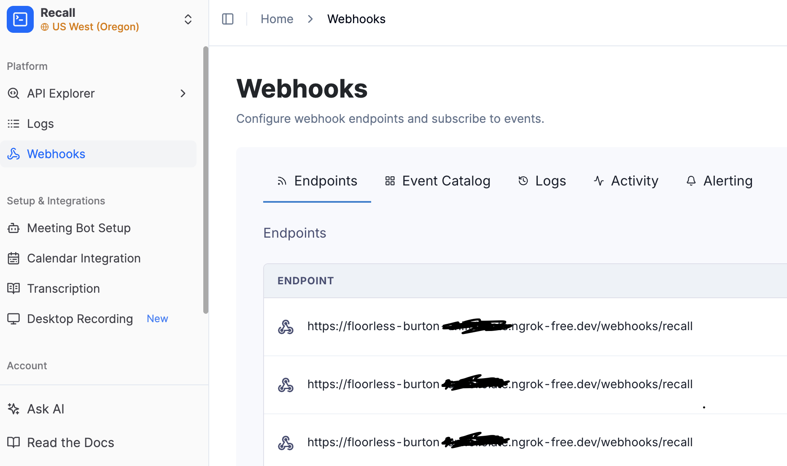
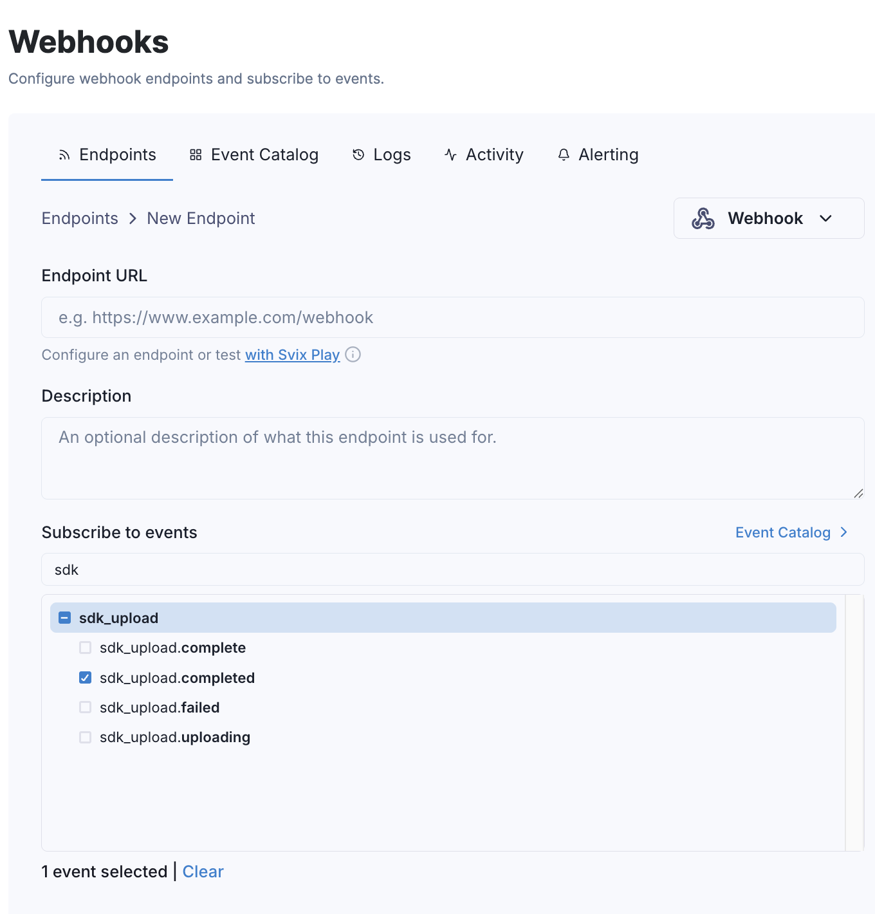

# Cliff Notetaker

Cliff Notetaker is an invisible meeting assistant built on Recall.ai’s [Desktop SDK](https://www.recall.ai/product/desktop-recording-sdk), using Electron and Express, that listens to your meetings and summarizes key points. 

Link to the docs for the [Desktop SDK](https://docs.recall.ai/docs/desktop-sdk)

Follow the steps below to get it running on your machine!

---

## Features

- Automatic meeting detection
- Background recording using Recall.ai's Desktop SDK
- Transcript generation
- AI meeting summaries using OpenAI
- Displays:
  - Meeting participants
  - Meeting link
  - Transcript
  - AI summary

---

# Setup

## 1. Clone the repository

```bash
git clone <your-repo-url>
cd <repo-name>
```

---

## 2. Download the Desktop Recording SDK on your computer

```bash
npm install @recallai/desktop-sdk
```

---


## 3. Create API Keys

Create accounts and API keys from:

- [Recall.ai](https://www.recall.ai)  
- [OpenAI Platform](https://platform.openai.com)

---

## 4. Add Environment Variables

Rename the .env.example file inside of backend to .env and replace the following

```
RECALL_API_KEY=your_recall_api_key
OPENAI_API_KEY=your_openai_api_key
RECALL_API_BASE=your_api_base_when_you_signup
```

---

## 5. Install Dependencies

From the root directory:

```bash
npm install
```

---

## 6. Start an ngrok Tunnel

[Recall.ai](https://www.recall.ai) requires a **public webhook endpoint**, so we expose the backend with ngrok. 

First make sure you add the authtoken on ngrok:

```bash
ngrok config add-authtoken <token>
```

Open a new terminal in your root directory, run:

```bash
ngrok http 3000
```

You will receive a URL similar to:

```
https://abc123.ngrok-free.app
```



---

## 7. Configure Recall.ai Webhooks

Login to [Recall.ai](https://www.recall.ai), go to your **Recall Dashboard** and configure the [webhook URL.](https://docs.recall.ai/reference/webhooks-overview)

Add the following endpoint:

```
https://YOUR_NGROK_URL/webhooks/recall
```

Example:

```
https://abc123.ngrok-free.app/webhooks/recall
```



Add events such as: 

- `sdk_upload.completed`
- `transcript.done`



These events allow the backend to:

- retrieve the recording
- create a transcript
- retrieve the transcript
- trigger AI summarization

---

## 8. Run the Backend Server

Open a new terminal in your root directory:

```bash
cd backend
```

Install required dependencies in the backend directory
``` bash
npm install 
```

```
node server.js
```

The backend will run at:

```
http://localhost:3000
```

---

## 9. Start the Electron App

Open another terminal from the **root directory**:

```bash
npm start
```

---

# How It Works

1. The Electron app detects a meeting window.
2. A recording starts using the Desktop SDK.
3. When the meeting ends, Recall.ai returns:

```
sdk_upload.completed
```

4. The backend retrieves the **recording ID**.
5. A transcript job is created.
6. Recall.ai sends:

```
transcript.done
```

7. The backend retrieves the transcript.
8. The transcript is sent to **OpenAI** for summarization.
9. The UI displays:

- Meeting participants
- Meeting link
- Transcript
- AI summary

---

# Tech Stack

- [Recall.ai Desktop SDK](https://www.recall.ai/product/desktop-recording-sdk) 
- Electron
- Express
- OpenAI API
- ngrok
